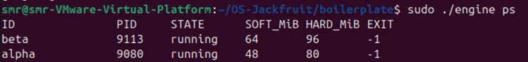
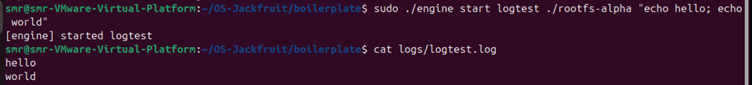
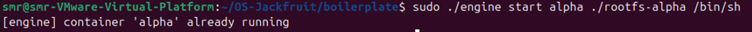
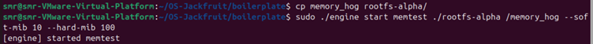
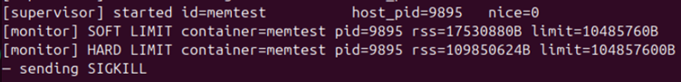
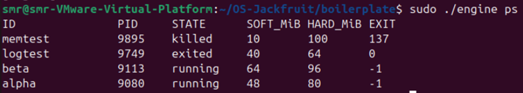
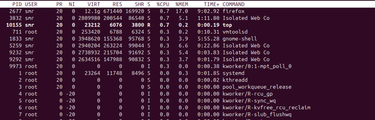
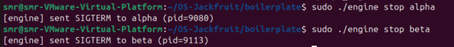
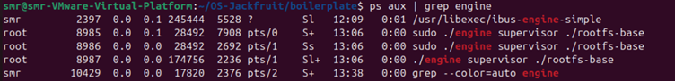

# Multi-Container Runtime — Documentation of everything

This document explains how to build, run, and evaluate the container runtime from a fresh Ubuntu VM along with justifications as to why certain design choices were taken over others

----------

# 1. Build, Load, and Run Instructions

Ensure you're running a**fresh Ubuntu 22.04 or 24.04 VM** with Secure Boot disabled.

## Install dependencies

```bash
sudo apt update
sudo apt install -y build-essential linux-headers-$(uname -r) wget

```

----------

# Prepare the Alpine container root filesystem

Create the base root filesystem used by containers.

```bash
mkdir rootfs-base
wget https://dl-cdn.alpinelinux.org/alpine/v3.20/releases/x86_64/alpine-minirootfs-3.20.3-x86_64.tar.gz
tar -xzf alpine-minirootfs-3.20.3-x86_64.tar.gz -C rootfs-base
```

This directory serves as the **template filesystem** for containers.

Each container must use a **separate writable copy**.

----------

# Build the project

Compile the user-space runtime, workloads, and kernel module.

```bash
make
```

This should majorly produce engine and monitor.ko . However, if an error exists, it is perhaps because you're running an older Liniux kernel (faced this issue personally). In this case, update the kernel and then run:
```bash
make clean
make
```

----------

# Load the kernel module

```bash
sudo insmod monitor.ko
```

Verify that the kernel module created the control device:

```bash
ls -l /dev/container_monitor
```

Expected output should include:

```
/dev/container_monitor
```

----------

# Start the supervisor

Launch the long-running container supervisor.

```bash
sudo ./engine supervisor ./rootfs-base

```

The supervisor remains active and manages containers through CLI commands.

----------

# Create container root filesystems

Each container must run on its own writable filesystem copy.

```bash
cp -a ./rootfs-base ./rootfs-alpha
cp -a ./rootfs-base ./rootfs-beta

```

----------

# Launch containers

In a second terminal, start two containers.

```bash
sudo ./engine start alpha ./rootfs-alpha /bin/sh --soft-mib 48 --hard-mib 80
sudo ./engine start beta ./rootfs-beta /bin/sh --soft-mib 64 --hard-mib 96
```

Each container runs inside its own namespace and filesystem.

----------

# List running containers

```bash
sudo ./engine ps
```

This command displays container metadata including:

-   container ID
-   host PID
-   state
-   configured memory limits
-   exit status
    

----------

# Inspect container logs

```bash
sudo ./engine logs alpha
```

Logs are written to the `logs/` directory and captured through the bounded-buffer logging pipeline.

----------

# Run workload experiments

Before launching workloads inside a container, copy the workload binary into the container’s root filesystem.

Example:

```bash
cp cpu_hog ./rootfs-alpha/
```

Then run:

```bash
sudo ./engine start cpu-test ./rootfs-alpha /cpu_hog
```

----------

# Stop containers

```bash
sudo ./engine stop alpha
sudo ./engine stop beta
```

----------

# Inspect kernel monitor output

```bash
dmesg | tail
```

You should observe soft-limit warnings or hard-limit kills if containers exceeded memory limits.

----------

# Stop supervisor and unload module

Terminate the supervisor (Ctrl+C in the supervisor terminal).

Then unload the kernel module:

```bash
sudo rmmod monitor
```

Verify cleanup:

```bash
ps aux | grep engine
```

No zombie container processes should remain.

----------

# 2. Demo with Screenshots

The following screenshots demonstrate that the runtime satisfies project requirements.

---

## 1. Multi-container supervision



---

## 2. Metadata tracking


---

## 3. Bounded-buffer logging



---

## 4. CLI and IPC communication



---

## 5. Soft-limit warning





---

## 6. Hard-limit enforcement



---

## 7. Scheduling experiment



---

## 8. Clean teardown




----------

# 3. Engineering Analysis

The runtime demonstrates several key operating system mechanisms:

-   namespace-based process isolation
-   filesystem isolation using chroot
-   centralized container lifecycle management through a supervisor
-   concurrent logging using producer–consumer synchronization
-   kernel-space memory monitoring using a linked list and timer
-   Linux scheduling behavior through controlled experiments
    

These mechanisms illustrate how container runtimes interact with the Linux kernel to provide isolated execution environments.

----------

# 4. Design Decisions and Tradeoffs

## Namespace Isolation

**Design choice**

Containers use PID, UTS, and mount namespaces with `chroot()` filesystem isolation.

**Tradeoff**

`chroot()` is weaker than `pivot_root()` for filesystem isolation.

**Justification**

`chroot()` provides sufficient isolation for this educational runtime while keeping implementation complexity manageable.

----------

## Supervisor Architecture

**Design choice**

A long-running supervisor manages container lifecycle and metadata.

**Tradeoff**

The supervisor becomes a central dependency; if it crashes, container management stops.

**Justification**

A centralized control process simplifies lifecycle management, logging coordination, and signal handling.

----------

## IPC and Logging Design

**Design choice**

FIFOs for CLI control channel and pipes for container logging.

**Tradeoff**

FIFOs are half-duplex and require separate response pipes per client.

**Justification**

FIFOs provide atomic message delivery and minimal implementation complexity compared to sockets or shared memory.

----------

## Kernel Memory Monitor

**Design choice**

Memory limits enforced through a kernel module using periodic RSS checks.

**Tradeoff**

Kernel code is harder to debug and requires root privileges to load.

**Justification**

Kernel enforcement avoids race conditions and allows direct access to process memory accounting structures.

----------

## Scheduling Experiments

**Design choice**

Use `nice()` values and different workloads to observe scheduling behavior.

**Tradeoff**

Results depend on system load and CPU configuration.

**Justification**

Priority adjustments provide a simple and observable method for demonstrating scheduler fairness and responsiveness.

----------

# Conclusion

This runtime demonstrates how operating system primitives combine to implement container environments.

Through namespace isolation, process supervision, concurrent logging, kernel monitoring, and scheduler experiments, the project illustrates the key mechanisms that enable modern container platforms.

